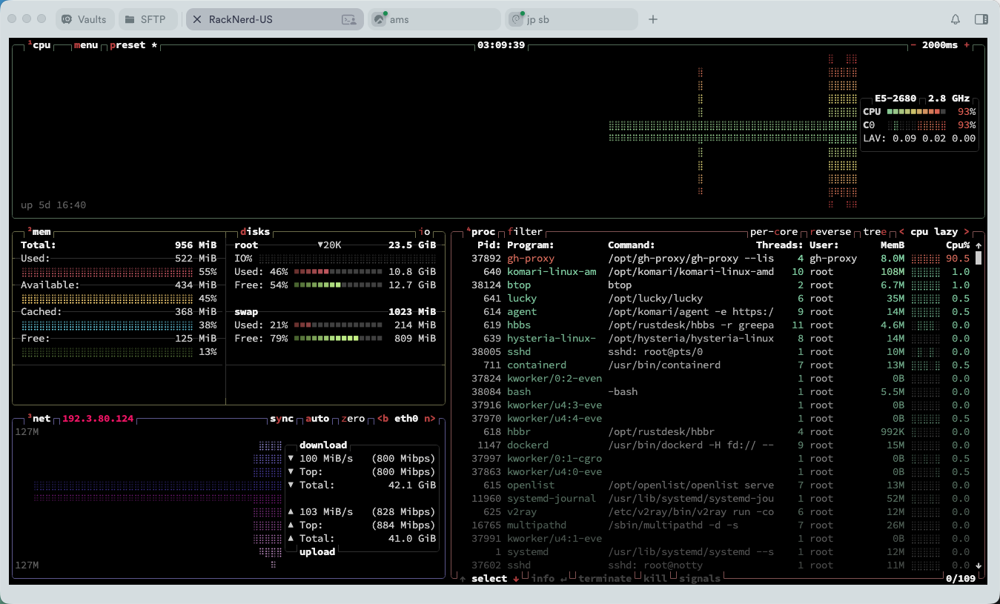

# gh-proxy

基于 Pingora 的高性能 GitHub / Docker Hub 流式反向代理，默认监听 `0.0.0.0:1555`。

## 一键安装

Linux/macOS 一键安装脚本：

```bash
curl -fsSL https://raw.githubusercontent.com/greepar/gh-proxy-rs/main/install.sh | sudo bash
```

Docker 一键部署：

```bash
docker run -d --name gh-proxy --restart unless-stopped \
  --read-only \
  --tmpfs /tmp:size=16m,mode=1777 \
  --security-opt no-new-privileges:true \
  --cap-drop ALL \
  -p 1555:1555 \
  -e GH_PROXY_GITHUB_HOST=github-proxy.example.com \
  -e GH_PROXY_DOCKER_HOST=docker-proxy.example.com \
  -e GH_PROXY_DOCKER_AUTH_HOST=docker-auth.example.com \
  ghcr.io/greepar/gh-proxy-rs:latest
```

## 性能

单核老 E5 下带宽和资源占用.



## 域名和回源

安装菜单会要求设置自己的代理域名。若使用 Cloudflare，可将每个 Public Hostname 的 Origin 配置为服务器公网 IP 和 gh-proxy 监听端口，并保留原始 `Host`。例如监听 `0.0.0.0:1555` 时：

| Host | 上游 |
| --- | --- |
| `github-proxy.example.com` | GitHub、Release、Raw、Codeload |
| `docker-proxy.example.com` | `registry-1.docker.io` 与固定 GHCR 前缀 |
| `docker-auth.example.com` | Docker Hub token 服务 |

配置示例：

```text
GH_PROXY_LISTEN=0.0.0.0:1555
GH_PROXY_GITHUB_HOST=github-proxy.example.com
GH_PROXY_DOCKER_HOST=docker-proxy.example.com
GH_PROXY_DOCKER_AUTH_HOST=docker-auth.example.com
```

Docker 域名可在安装时留空，此时仅启用 GitHub 代理。

```bash
git clone https://github-proxy.example.com/owner/repository.git
```

Docker `/etc/docker/daemon.json`：

```json
{"registry-mirrors":["https://docker-proxy.example.com"]}
```

Docker 代理域名同时支持 Docker Hub 与固定 GHCR 前缀：

```bash
# Docker Hub
docker pull docker-proxy.example.com/library/alpine:latest

# GitHub Container Registry
docker pull docker-proxy.example.com/ghcr.io/greepar/gh-proxy-rs:latest
```

GHCR 前缀仅映射到 `ghcr.io`，不接受任意 Registry 域名。

## 本地构建

```bash
cargo build --release
./target/release/gh-proxy --listen 0.0.0.0:1555
```
